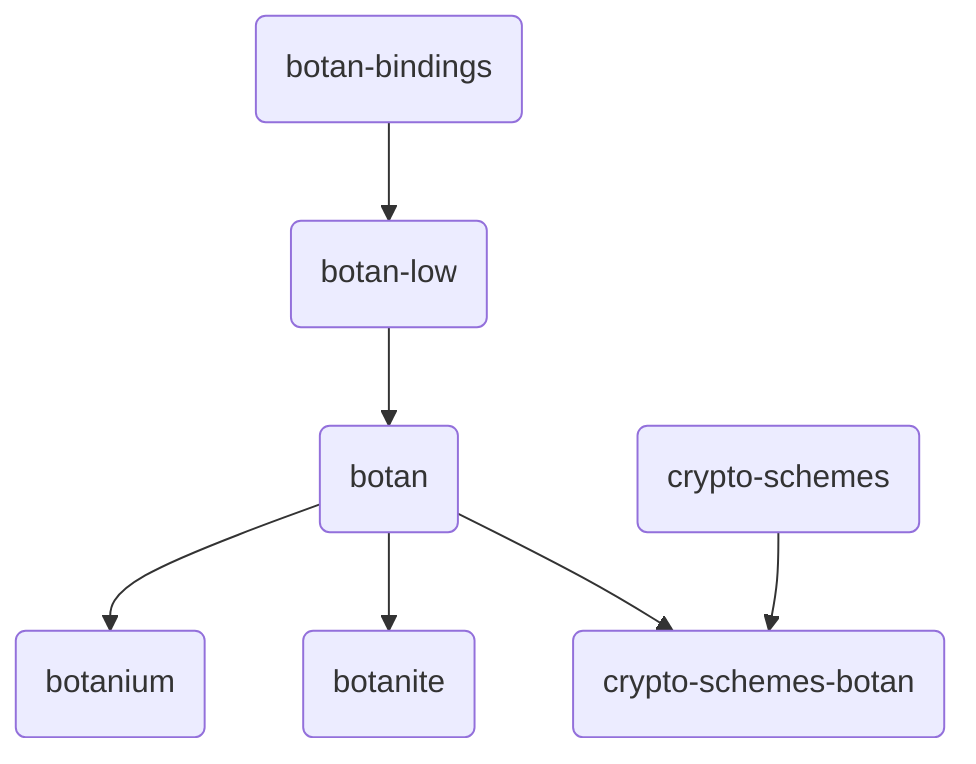
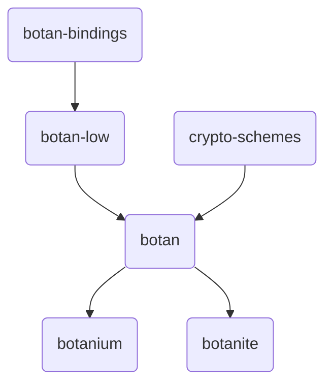

# Proposed Library Hierarchy

## Existing hierarchy

```mermaid
graph TD

    BB(botan-bindings)
    BL(botan-low)
    B(botan)
    BM(botanium)
    BT(botanite)
    %% CU(crypto-utility)
    CS(crypto-schemes)
    CSB(crypto-schemes-botan)

    BB --> BL --> B --> BM & BT & CSB
    %% CU --> B & CS
    CS --> CSB

```

## Alternative hierarchy

- Ditches `crypto-schemes-botan`, implements `botan` using `crypto-schemes`

```mermaid
graph TD

    BB(botan-bindings)
    BL(botan-low)
    B(botan)
    BM(botanium)
    BT(botanite)
    %% CU(crypto-utility)
    CS(crypto-schemes)

    BB --> BL --> B
    %% CU --> CS
    CS --> B
    B --> BM & BT
```